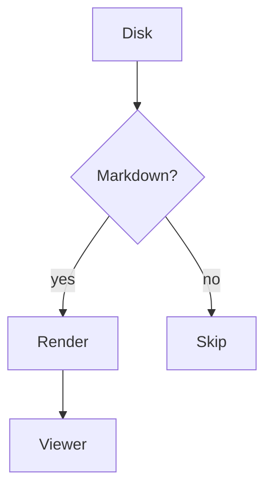

# Mermaid Render Test

```mermaid
flowchart TD
  A[Disk] --> B{Markdown?}
  B -->|yes| C[Render]
  B -->|no| D[Skip]
  C --> E[Viewer]
```

That diagram should render as a real SVG above (not a fallback box).

## After the diagram

A short paragraph so there's content below the rendered chart.
